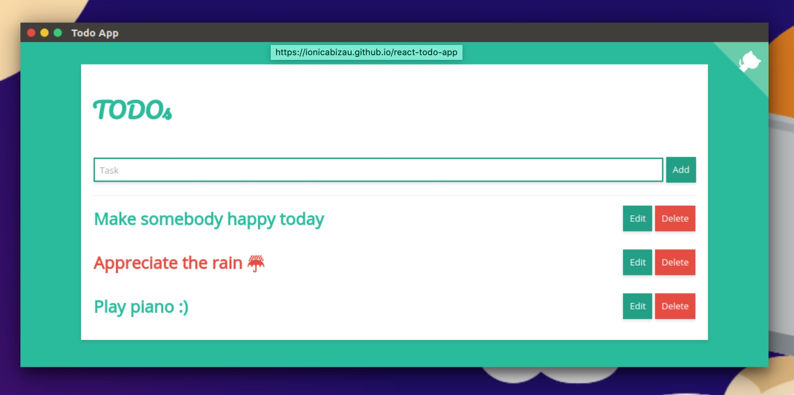

# ReactJS Todo App


### [View all Roadmaps](https://github.com/nholuongut/all-roadmaps) &nbsp;&middot;&nbsp; [Best Practices](https://github.com/nholuongut/all-roadmaps/blob/main/public/best-practices/) &nbsp;&middot;&nbsp; [Questions](https://www.linkedin.com/in/nholuong/)
<br/>

> A React powered todo app.

**Hey!** :blush: This is my first project in React. If you find any tips, please share them with me and let me know what can pe improved.



## :cloud: Installation

```sh
git clone https://github.com/nholuongut/reactjs-todo-list.git
cd reactjs-todo-list
npm i
npm run start:dev
open localhost:8080

# To build the app for production, run the following command:
npm run bundle
```

## :yum: How to contribute
Have an idea? Found a bug? See [how to contribute][contributing].


# 🚀 I'm are always open to your feedback.  Please contact as bellow information:
### [Contact ]
* [Name: nho Luong]
* [Skype](luongutnho_skype)
* [Github](https://github.com/nholuongut/)
* [Linkedin](https://www.linkedin.com/in/nholuong/)
* [Email Address](luongutnho@hotmail.com)


[](https://ko-fi.com/nholuong)

# License
* Nho Luong (c). All Rights Reserved.🌟
